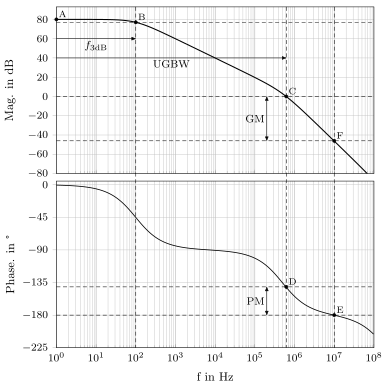

# bode-plot-characteristics-cheatsheet
[![CC BY 4.0][cc-by-shield]][cc-by]

This cheat sheet summarizes how to extract features such as 
unity-gain bandwidth (UGBW) or phase margin (PM) from a bode plot.

> [!NOTE]
> You may utilize a different terminology than explained here.

The figure below shows the magnitude (top) and phase (bottom) of a
bode plot.
In this illustration, the phase is 0° for $f \rightarrow 0$.
In other literature, the phase is set to 180° for $f \rightarrow 0$.
Several points ($\mathrm{A}$ - $\mathrm{F}$) are annotated in the plot, each 
point has a $x$ value (corresponding to a frequency) and a $y$ value 
(corresponding either to the magnitude in dB or phase in °).

 

By evaluating the magnitude at $f \rightarrow 0$ (point $\mathrm{A}$), the
DC gain (corresponding to $y_{\mathrm{A}}$) is extracted.
We refer to the DC gain as $A_0$ (80 dB in this example).

Next, the 3dB bandwidth $f_{\mathrm{3dB}}$ (a.k.a. cutoff frequency, 
corner frequency, or break frequency) of the plot is evaluated. Therefore, we 
set

$$
y_{\mathrm{B}} = y_{\mathrm{A}} - 3 \mathrm{dB}
$$

and extract the matching $x_{\mathrm{B}} = f_{\mathrm{3dB}}$ 
(100 Hz in this example).

Based on that, the **gain-bandwidth product**

$$
\mathrm{GBP} = A_0 \cdot f_{\mathrm{3dB}}
$$

is calculated (a.k.a. $\mathrm{GBW}$ or $\mathrm{GB}$). 
You have to convert the DC gain $A_0$ from decibel in the linear domain 
beforehand (80 dB = 10,000).
The $\mathrm{GBP}$ is 1 GHz in the example shown above.

The crossover of the magnitude with 0 dB (unity-gain, i.e. gain of one) results 
in the point $C$.
The x coordinate $x_{\mathrm{C}}$ of this point is the Unity-Gain Bandwidth 
$\mathrm{UGBW}$ (620 MHz in this example).

> [!IMPORTANT]
> $\mathrm{UGBW}$ and $\mathrm{GBP}$ is not the same!

Next, we obtain the point $\mathrm{D}$ in the phase plot by setting 
$x_{\mathrm{D}} = x_{\mathrm{C}}$, i.e. evaluate the phase at the 
$\mathrm{UGBW}$.
With this point, the **phase margin**

$$
\mathrm{PM} = 180° + y_{\mathrm{D}}
$$

is calculated (39° in this example).

The crossover of the phase with -180° results in the point $\mathrm{E}$.
By evaluating the magnitude at the same x coordinate, the point 
$\mathrm{F}$ is obtained ($x_{\mathrm{F}} = x_{\mathrm{E}}$).
With this point, the **gain margin**

$$
\mathrm{GM} = - y_{\mathrm{F}}.
$$

is calculated (46 dB in this example).

## License

This work is licensed under a
[Creative Commons Attribution 4.0 International License][cc-by].

[![CC BY 4.0][cc-by-image]][cc-by]

[cc-by]: http://creativecommons.org/licenses/by/4.0/
[cc-by-image]: https://i.creativecommons.org/l/by/4.0/88x31.png
[cc-by-shield]: https://img.shields.io/badge/License-CC%20BY%204.0-lightgrey.svg
